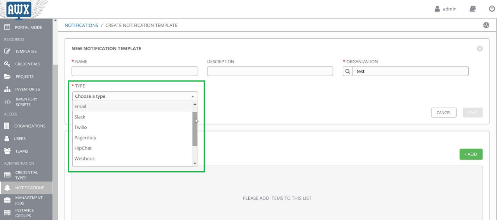
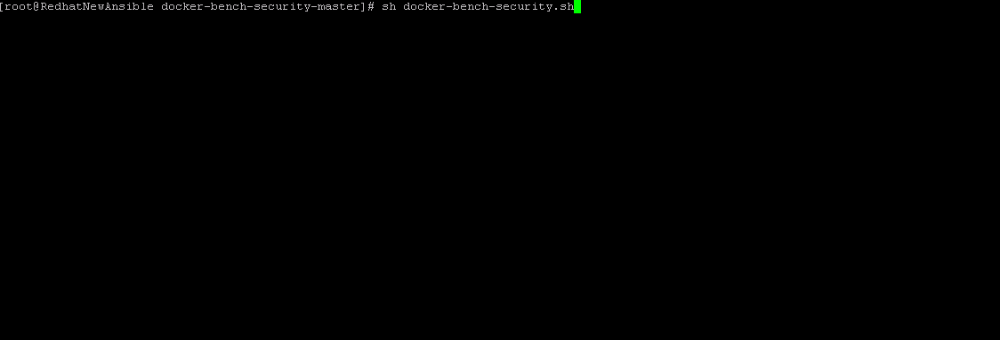

# awx-getting-started

  <a href="#Inventory">Inventory</a> •
  <a href="#Playbooks">Playbooks</a> •
  <a href="#Roles">Roles</a> •
  <a href="#Getting-Started">Getting Started</a> •
  <a href="#Notifications">Notifications</a> •
  <a href="#Docker-Security">Docker Security</a> •
  <a href="#related">Related</a> •
  <a href="#Authors">Authors</a>

## Getting Started
To run an Ansible Playbook with AWX, you need to configure the following items
- Credentials: User name/password or ssh key to connect to remote component
- Project: It contains the Ansible playbook, config, roles, templates etc
- Inventories : What servers the playbook will run against and connection specific configuration
- Templates: Job template to associate all of the above and run the playbook
- Launch Templates: Launching current project

## Notifications
AWX notifications provide a mechanism of signaling when AWX jobs succeed or fail. This can take the form of sending a message to a Slack channel, an email or sending an HTTP POST to another service to trigger other actions.
In AWX the following notification types are supported:
- Email
- Slack
- Hipchat
- Pagerduty
- Twilio
- IRC
- Webhook (POST)

## Docker Security
Docker offers the Docker Bench for Security script (https://github.com/docker/docker-bench-security) , which checks a Docker configuration against the published hardening guide: CIS DOCKER 1.12.0 BENCHMARK V1.0.0 (link). 
You can just download the script and run it straight from your host. Once you have run the script, you will be presented the output shown below:

The script results in Info, Warning, and Pass notes for each of the recommendations which are grouped into 5 sections:
Host Configuration
Docker Daemon Configuration
Docker Daemon Configuration Files
Container Images and Build Files
Container Runtime

Once the reported is generated, you can follow the mentioned benchmark document to remediate them.

## Related
* [AWX](https://github.com/ansible/awx) - Configuration Management
 
## Authors
* **Javier Baltar** - *Initial work* - [GitHub](https://github.com/JavierBaltar)

